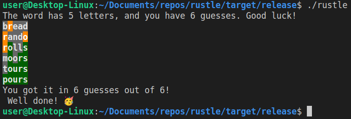

# Rustle
Wordle clone for the commandline, implemented in Rust. 

It has a list of 5-letter words built in, other word lengths are available in the `word_lists` folder.

```
USAGE:
    rustle [OPTIONS]

OPTIONS:
    -g, --guesses <GUESSES>        Maximum amount of guesses [default: 6]
    -h, --help                     Print help information
    -l, --list-file <LIST_FILE>    Path to a word list file
    -s, --separator <SEPARATOR>    Word separator for the word list [default: "\n"]
    -V, --version                  Print version information
    -w, --word <WORD>              Specific word to use
```

